# PIXOGRAM
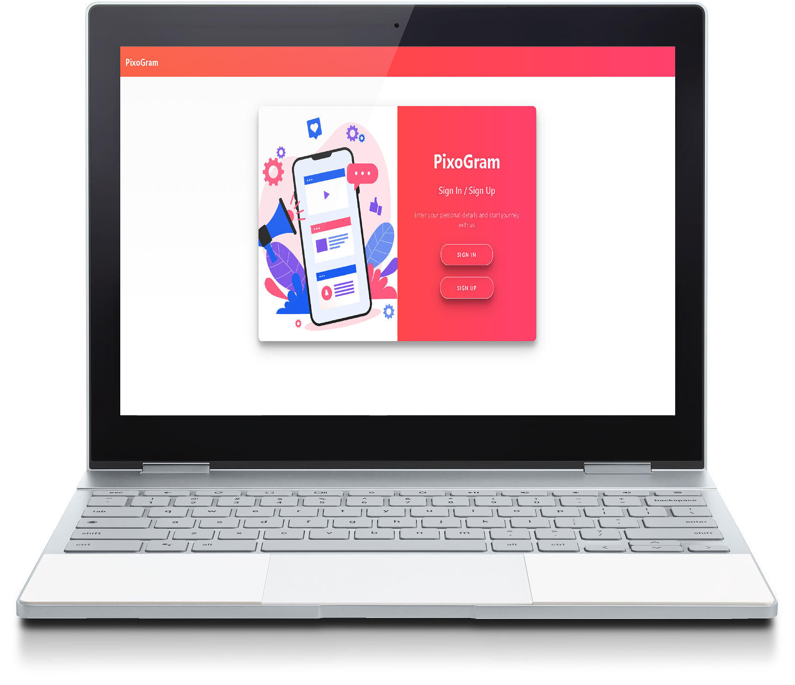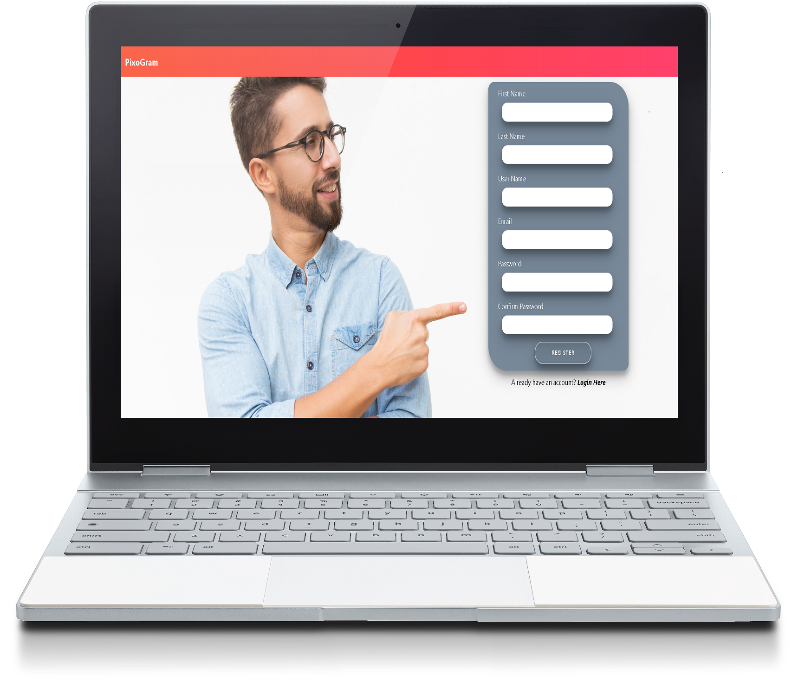 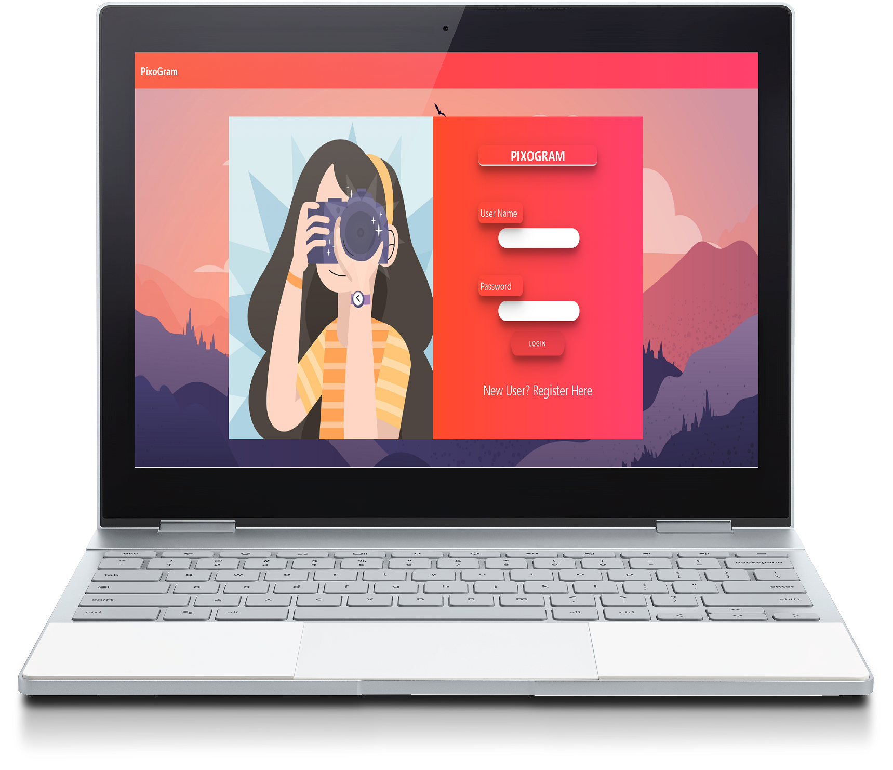 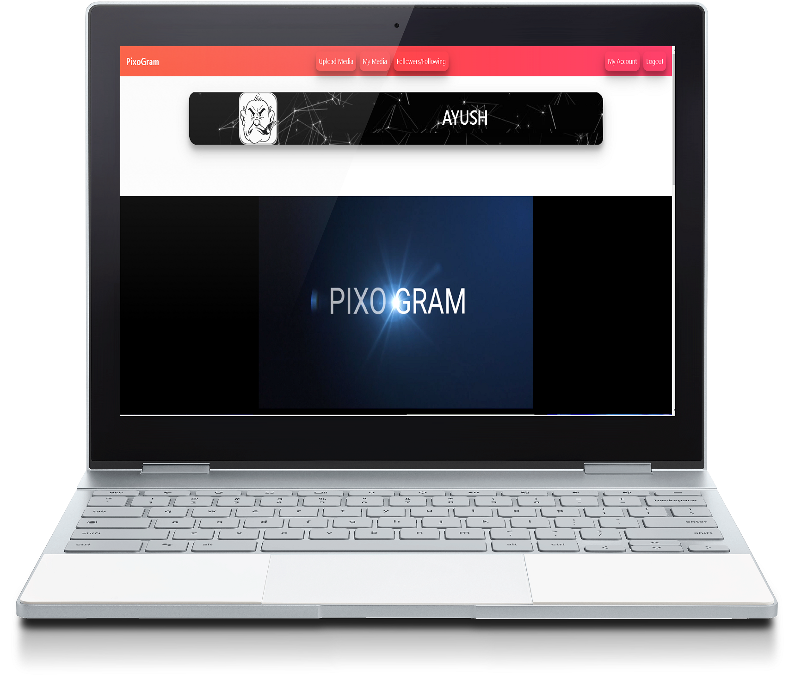 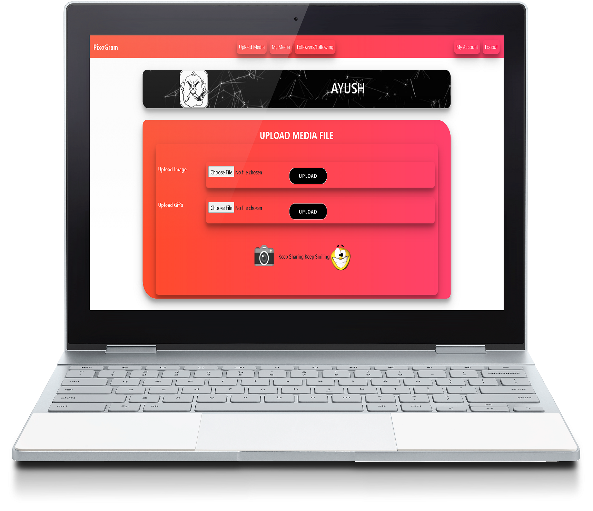
 
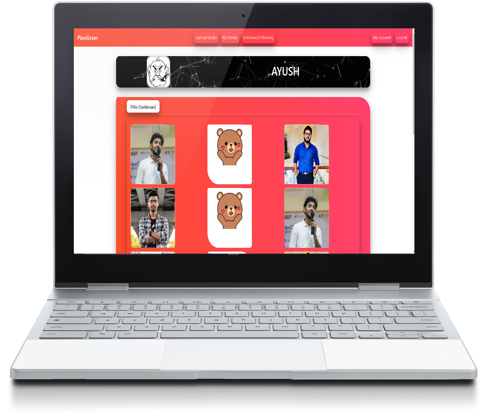 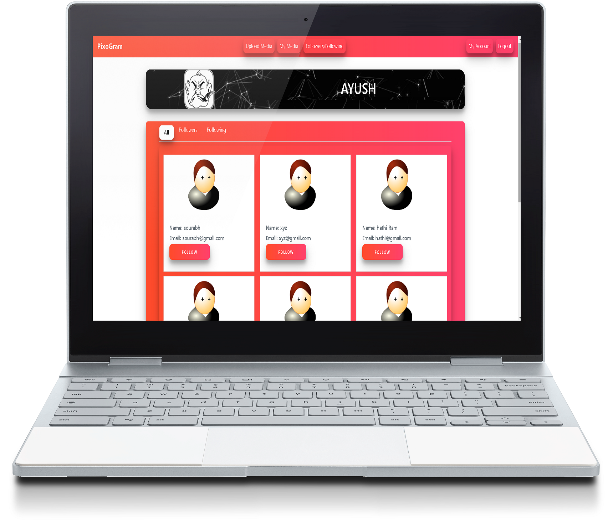 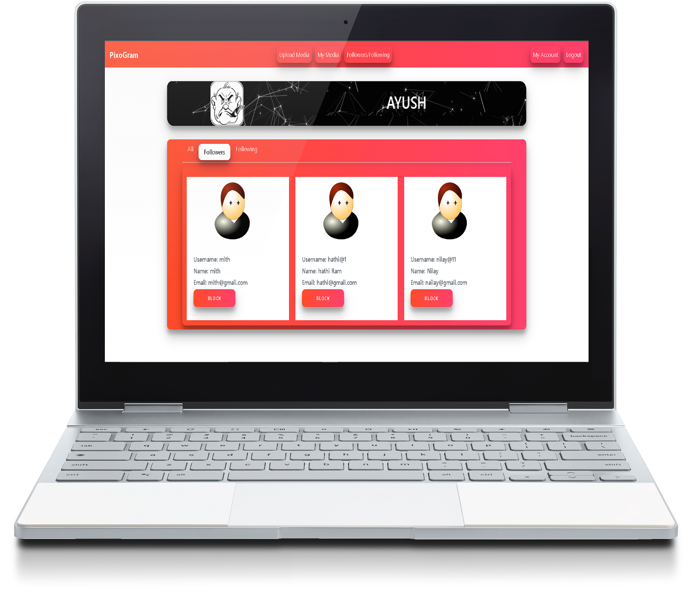  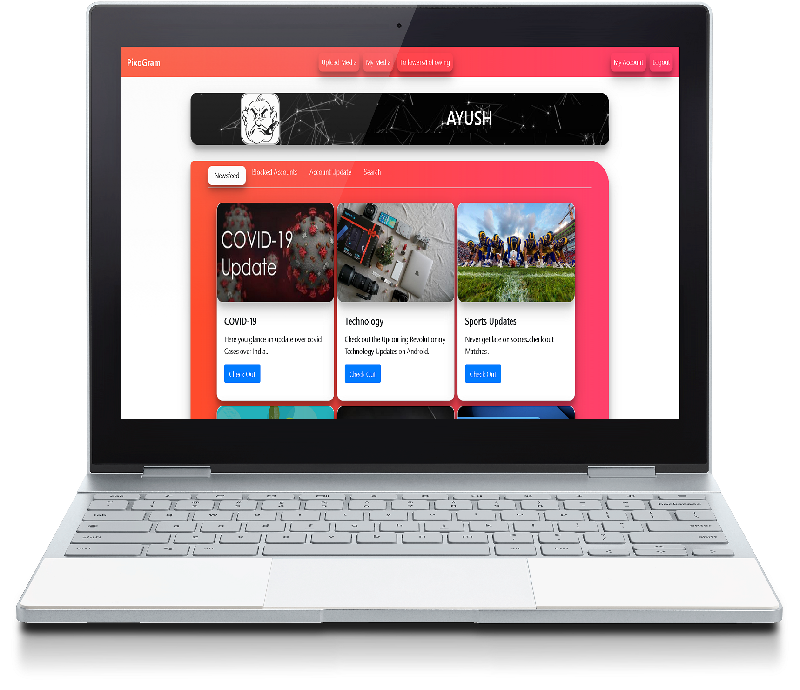
 
 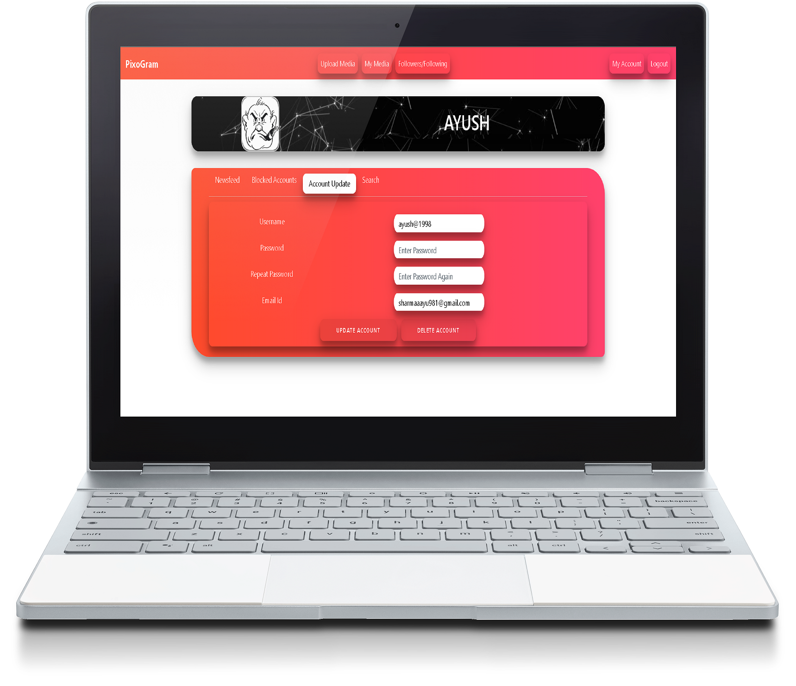 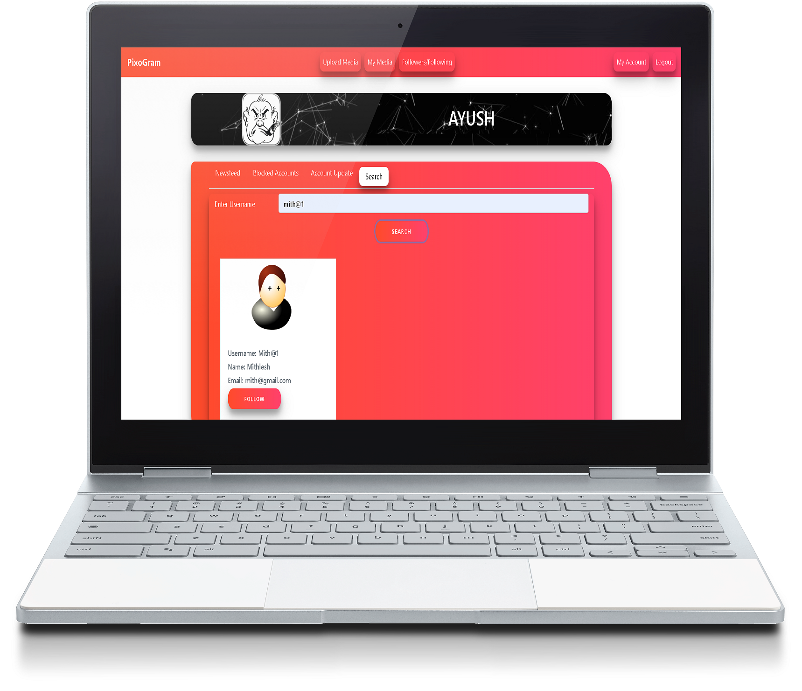 

## PIXOGRAM
PIXOGRAM is an all-new social media application that lets you connect with people, upload images & videos, and explore what's going around.

### Features 
The application comes with SignIn and SignUp flows which mean that if you're new to the platform, you'll have to create your account first to get going and if you're an existing user, you just can log in to the application and begin exploring. You can upload images and gif, you can follow and unfollow other users and more. You can also block users and unblock them whenever you want. You can also experience newsfeed.

### Start with PIXOGRAM
- Download or fork the project from github.
- Setup the Node Module in Angular.( Frontend) 
- Start the Microservice and main backend Service of Pixogram.
- Make a new database in MYSQL named "Pixo_db".
- Run Angular Project by ng serve in Cli and local server will started on port 4200
- In the Home window click on SIGN-UP and register the new user.
- Click on LOGIN and start your journey with PIXOGRAM

### Key Points
1. You can Delete and Update the current User.
2. Images and Gif's Can be uploaded.
3. You can search , block , follow and follow back the User.

### Contributing
Please raise an issue of the requirement or problem in deploy the project so that a discussion can take before any step, even if you intend to raise a pull request.

### Contact Us
* [LinkedIn](https://in.linkedin.com/in/sharmaayush981) 
* [Email](test1email320@gmail.com)
* [Twitter](https://twitter.com/i_ayush_sharma)

### Team
- Ayush Sharma
- Mohammed Saquib Ansari
- Vikalp Chauhan
-
-
-
-

### MIT License

Copyright (c) 2020 TEAM PIXO

Permission is hereby granted, free of charge, to any person obtaining a copy
of this software and associated documentation files (the "Software"), to deal
in the Software without restriction, including without limitation the rights
to use, copy, modify, merge, publish, distribute, sublicense, and/or sell
copies of the Software, and to permit persons to whom the Software is
furnished to do so, subject to the following conditions:

The above copyright notice and this permission notice shall be included in all
copies or substantial portions of the Software.

THE SOFTWARE IS PROVIDED "AS IS", WITHOUT WARRANTY OF ANY KIND, EXPRESS OR
IMPLIED, INCLUDING BUT NOT LIMITED TO THE WARRANTIES OF MERCHANTABILITY,
FITNESS FOR A PARTICULAR PURPOSE AND NONINFRINGEMENT. IN NO EVENT SHALL THE
AUTHORS OR COPYRIGHT HOLDERS BE LIABLE FOR ANY CLAIM, DAMAGES OR OTHER
LIABILITY, WHETHER IN AN ACTION OF CONTRACT, TORT OR OTHERWISE, ARISING FROM,
OUT OF OR IN CONNECTION WITH THE SOFTWARE OR THE USE OR OTHER DEALINGS IN THE
SOFTWARE.
